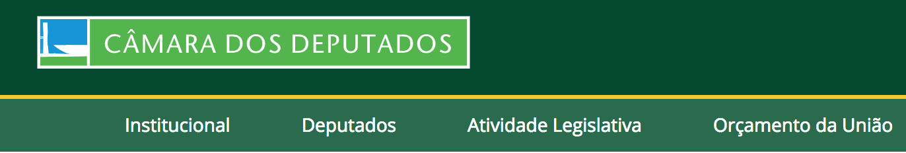
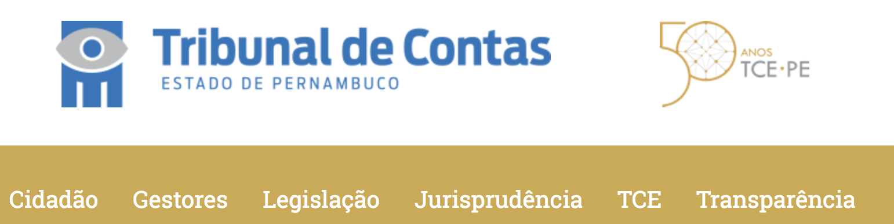

# Obtenção de conteúdo {#scrape}

<!--- preview_chapter("05-obtencao-conteudo.Rmd") --->

_Davi Moreira, Mônica Rocabado_

$~$ <!--- add line space --->

Uma das tarefas mais importantes para a análise de conteúdo consiste na sua própria 
busca e aquisição. O `R` nos ajuda nessa tarefa a partir de distintas estratégias. 
A seguir apresento aquelas nas quais o uso de técnicas computacionais e programação 
potencializa o alcance e escala de acervos a serem utilizados para pesquisas.


## word, excel ou `.pdf`{#pdf}

Caso tenha realizado surveys com perguntas abertas ou possua conteúdo de texto 
organizado em formato de documento ou tabulado é possível utilizar o `R` para 
analisá-las. Para arquivos em formato excel pode-se usar o pacote `readxl` com a 
função `read_excel`, funciona de forma similar ao exemplo em de leitura de arquivos 
em `.csv`. Para leitura de arquivos `.txt`, `.csv`, entre outros, recomenda-se 
utilizar o pacote `readr`. Vejamos um exemplo:


### `.xlsx` 

<center>

{width=700px}

</center>

A Câmara dos Vereadores de São Paulo publica dados de sua atividade no portal 
[SPLegis](http://app-splegisreport-prd.azurewebsites.net/default.aspx). Entre as 
informações disponíveis, é possível obter [relatórios dos projetos](http://app-splegisreport-prd.azurewebsites.net/Report/VIEW_REL_EMENDA/List.aspx) 
com o conteúdo de todas as ementas através do download de um arquivo em formato `.xlsx`!

```{r, echo = TRUE, eval = F, warning = F, message = F}
library(readxl)

arquivo_excel <- read_excel("Emendas Apresentadas.xlsx")
```

### `.pdf` e `.doc`

<center>

{width=400px}

</center>


Antes de achar que os dados de um arquivo `.pdf` ou `.doc` são um obstáculo para 
a abordagem do texto como dado, diferentes estratégias podem ser adotadas para sua 
obtenção e processamento. Com o uso do pacote `textreadr`, por exemplo, de forma 
simples pode-se transformar o conteúdo do arquivo `.pdf` num arquivo `.txt`. Vejamos o 
conteúdo do [discurso de posse do ex-presidente Luis Inácio Lula da Silva realizado em 
01 de janeiro de 2003 no Congresso Nacional](http://www.biblioteca.presidencia.gov.br/presidencia/ex-presidentes/luiz-inacio-lula-da-silva/discursos/1o-mandato/2003/01-01-pronunciamento-a-nacao-do-presidente-da-republica-luiz-inacio-lula-da-silva-apos-a-cerimonia-de-posse.pdf/view):

```{r, echo = TRUE, eval = F, warning = F, message = F}
library(textreadr)

# lendo arquivo .pdf
txt <- read_document("https://raw.githubusercontent.com/davi-moreira/txt4cs/master/data/lula-pronunciamento-posse-cd-2003.pdf")

# salvando como .txt
writeLines(txt, "lula-pronunciamento-posse-cd-2003.txt")

```

<!--- BRAPRSpeech --->

:::: {.infobox .note data-latex="note"}

Em breve, o **Projeto BRAPRSpeech** disponibilizará conteúdo e meta-dados de quase 7 mil 
discursos proferidos pelos presidentes brasileiros da Nova República classificados em áreas temáticas. Divulgaremos! 

::::


## Webscraping

<center>

{width=400px}

</center>


O *Webscraping* consiste na possibilidade de uso de programação para raspagem de 
dados da web, ou seja a obtenção de conteúdo presente na web. Nesse sentido, suponha 
que ao invés de montar uma equipe que irá acessar páginas na web para coletar seu 
conteúdo, você desenvolverá um programa específico para realizar essa tarefa com 
foco sobre os objetivos de sua pesquisa.

### Pacotes para raspagem de dados

Há diversos pacotes para raspagem de dados com o `R`. Abaixo segue um lista com os
principais. Para referências sobre seu uso, consulte os links indicados, 
[este tutorial sobre o `rvest`](https://www.datacamp.com/community/tutorials/r-web-scraping-rvest) e 
[este capitulo sobre web scraping](http://material.curso-r.com/scrape/). 

* [`httr`](https://cran.r-project.org/web/packages/httr/vignettes/quickstart.html)
* [`xml2`](https://cran.r-project.org/web/packages/xml2/xml2.pdf)
* [`rvest`](https://blog.rstudio.com/2014/11/24/rvest-easy-web-scraping-with-r/)

Como o site [Curso-R](http://material.curso-r.com/scrape/) destaca, esses pacotes 
não são suficientes para acessar todo tipo de conteúdo da web. Páginas com conteúdo 
produzido na linguagem `javascript`, por exemplo, precisam de outras ferramentas para 
acesso a seu conteúdo. Nesses casos, é necessário “simular” um navegador que acessa 
a página web e realiza consultas. Uma das melhores ferramentas para isso é o 
`selenium`, abaixo indicado.

* [`RSelenium`](https://ropensci.org/tutorials/rselenium_tutorial/)

### Etapas para raspagem de dados na web

O processo de raspagem dos dados consiste nas seguintes etapas:

* **Etapa 1:** Conhecer detalhadamente o caminho para acesso aos dados
  + Qual o caminho que um usuário necessita realizar para obter os dados? 
  + É necessário preencher um formulário ou assinalar um Recapctha?
  
* **Etapa 2:** Armazenar todos os caminhos de acesso aos dados de forma amigável ao programa
  + Caso exista um caminho para obter esse dado, deve ser registrado
  + Não é necessário realizar esse procedimento em todos as páginas que for realizar, mas é desejável.

* **Etapa 3:** Obter os dados: raspagem de fato

* **Etapa 4:** Processar os dados obtidos

### Código fonte 

Toda página na internet possui um código-fonte - muitas vezes em `html`  - que indica 
e cria o conteúdo de forma visual para página. Ao clicar na página desejada com o 
botão direito do mouse e selecionar “código fonte” ou digitar `CRTL + U`, pode-se 
visualizá-lo. Vejamos um exemplo:

<center>

{width=700px}

</center>

<!--- o codigo abaixo permite deixar uma pagina embeded no livro --->
```{r, echo = F, eval = F, warning = F, message = F}
knitr::include_url("https://www.camara.leg.br")
```

Ao acessar o código fonte dessa [página do portal da Câmara dos Deputados](https://www.camara.leg.br/internet/SitaqWeb/TextoHTML.asp?etapa=5&nuSessao=174.4.53.O&nuQuarto=56&nuOrador=2&nuInsercao=0&dtHorarioQuarto=11:46&sgFaseSessao=BC&Data=17/08/2010&txApelido=JAIR%20BOLSONARO,%20PP-RJ&txFaseSessao=Breves%20Comunica%C3%A7%C3%B5es&txTipoSessao=Extraordin%C3%A1ria%20-%20CD&dtHoraQuarto=11:46&txEtapa=), você consegue visualizar o código `.html` que produz toda visualização, 
incluindo o conteúdo do discurso proferido pelo então deputado Jair Bolsonaro em 17 de Agosto de 2010^[Conteúdo publicado pela Câmara dos Deputados sem revisão do autor.].

### Obtenção de Código Fonte - Exemplo:

Se é possível visualizar o conteúdo, é possível obtê-lo de forma automatizada. Vamos, portanto, 
obter [o conteúdo do discurso proferido pelo então deputado Jair Bolsonaro](https://www.camara.leg.br/internet/SitaqWeb/TextoHTML.asp?etapa=5&nuSessao=174.4.53.O&nuQuarto=56&nuOrador=2&nuInsercao=0&dtHorarioQuarto=11:46&sgFaseSessao=BC&Data=17/08/2010&txApelido=JAIR%20BOLSONARO,%20PP-RJ&txFaseSessao=Breves%20Comunica%C3%A7%C3%B5es&txTipoSessao=Extraordin%C3%A1ria%20-%20CD&dtHoraQuarto=11:46&txEtapa=)  em 17 de Agosto de 2010^[Conteúdo publicado pela Câmara dos Deputados sem revisão do autor.].

Vamos utilizar as Etapas anteriormente apresentadas:

De uma só vez, conseguimos cumprir as Etapas 1 e 2 com o código abaixo:

**Etapa 1: Conhecer detalhadamente o caminho para acesso aos dados:** no nosso exemplo, o código 
fonte do endereço virtual que apresenta o discurso também nos apresenta o conteúdo publicado.

**Etapa 2: Armazenar todos os caminhos de acesso aos dados de forma amigável ao programa:** nesse exemplo, 
trata-se de apenas um endereço que armazenamos no objeto `link`.

```{r, echo = TRUE, eval = F, warning = F, message = F}
# carregando pacotes ----
library(tidyverse)
library(rvest)
library(httr)
library(xml2)

# definindo o endereço da web
link <- "https://www.camara.leg.br/internet/SitaqWeb/TextoHTML.asp?etapa=5&nuSessao=174.4.53.O&nuQuarto=56&nuOrador=2&nuInsercao=0&dtHorarioQuarto=11:46&sgFaseSessao=BC&Data=17/08/2010&txApelido=JAIR%20BOLSONARO,%20PP-RJ&txFaseSessao=Breves%20Comunica%C3%A7%C3%B5es&txTipoSessao=Extraordin%C3%A1ria%20-%20CD&dtHoraQuarto=11:46&txEtapa="
```

**Etapa 3: Obter os dados:** Podemos facilmente obter o código fonte de um endereço 
na internet com o uso da função `readLines`. Aplicamos, portanto, a função no 
objeto `link` e atribuímos seu resultado ao objeto `conteudo`.

```{r, echo = TRUE, eval = F, warning = F, message = F}
# obtem o codigo fonte
conteudo <- readLines(link)  
```

Veja que o objeto `conteudo` é um vetor cujos elementos são cada uma das linhas 
presentes no código fonte da página. Isso significa que não precisamos mais do 
acesso à internet ou do próprio endereço para processar o conteúdo obtido uma vez 
que já está retido no seu ambiente de trabalho no `R`. Nessa etapa, pode ser 
conveniente salvar o objeto `conteudo` em seu formato bruto para posterior 
tratamento.

**Etapa 4: Processar os dados obtidos:** 

Para finalizar nossa tarefa, uma rápida análise do objeto `conteudo` (código fonte 
da página que publicou o discurso), nos mostra que o elemento `328` do vetor apresenta 
o conteúdo de interesse. Veja que, nesse caso, a análise do próprio código fonte da 
página da Câmara dos Deputados apresenta o conteúdo do discurso na linha 328 do código `html`.

Para processar os dados obtidos, vamos selecionar apenas o elemento 328 e assim concluímos nossa missão.

```{r, echo = TRUE, eval = F, warning = F, message = F}
conteudo <- conteudo[328]
```

#### Atividade prática

Com base no exemplo acima, obtenha o código fonte da página do [Chico Buarque na Wikipédia](https://pt.wikipedia.org/wiki/Chico_Buarque). 

## Web Services

Os [Web services](https://pt.wikipedia.org/wiki/Web_service) são utilizados para 
disponibilizar serviços interativos na Web, podendo ser acessados por outras 
aplicações. O objetivo dos Web Services é a comunicação de aplicações através da Internet. 
Um dos motivos que tornam os Web Services atrativos para a obtenção de dados e conteúdo é 
o fato deste serviço ser desenvolvido com base em tecnologias _standards_, em particular 
`XML` e `HTTP` (Hypertext Transfer Protocol). 

### Obtenção de conteúdo via WS - Exemplo:

A Câmara dos Deputados do Brasil possui um excelente serviço de transparência. 
Estimulado pela iniciativa do [Laboratório Hacker](http://labhackercd.leg.br/), foi desenvolvido 
o [Web service da Câmara dos Deputados](http://www2.camara.leg.br/transparencia/dados-abertos/dados-abertos-legislativo/webservices).

Após a realização da Primeira Maratona Hacker da Câmara dos Deputados em 2013, quando fora 
desenvolvido o [Projeto Retórica Parlamentar](http://retorica.labhackercd.leg.br/), o Web Service 
da CD passou a disponibilizar os discursos proferidos pelos deputados federais em plenário.

<center>

{width=400px}

</center>

Os [ataques terroistas de 11 de setembro de 2001](https://pt.wikipedia.org/wiki/Ataques_de_11_de_setembro_de_2001) 
chocaram o mundo e os deputados federais brasileiros não ficaram em silêncio diante de 
fato tão relevante. Nossa tarefa será a de obter os dados e o conteúdo dos discursos proferidos nesse dia terrível. 
Em virtude da estrutura de disponibilização dos dados no WebService da Câmara dos Deputados, nossa tarefa será dividida em duas subtarefas: 

a) obter os meta-dados dos discursos; 
b) obter o conteúdo dos discursos (inteiror teor).

:::: {.infobox .note data-latex="note"}

Em breve, o **Projeto BRAParlSpeech** disponibilizará conteúdo e meta-dados de quase 300 mil 
discursos de parlamentares brasileiros classificados em áreas temáticas. Divulgaremos! 

::::

### a) obter os meta-dados dos discursos

Vamos utilizar as Etapas anteriormente apresentadas:

De uma só vez, conseguimos realizar as Etapas 1 e 2:

**Etapa 1: Conhecer detalhadamente o caminho para acesso aos dados:** 

Conhecendo exatamente como deve ser a chamada (o endereço que dá acesso aos dados), 
podemos simplesmente passar os parâmetros. Os parâmetros podem ser encontrados no guia do [WebService](https://www2.camara.leg.br/transparencia/dados-abertos/dados-abertos-legislativo/webservices/sessoesreunioes-2/listardiscursosplenario). 
No nosso exemplo, temos como parâmetros a data inicial (`dataInicial`) e a data 
final (`dataFinal`) de busca pelos discursos. Sendo nosso objetivo obter os 
discursos proferidos num mesmo dia, usamos como parâmetros "11/09/2001".

**Etapa 2: Armazenar todos os caminhos de acesso aos dados de forma amigável ao programa:** 

Nesse exemplo, trata-se de apenas um endereço que armazenamos no objeto `link`.

```{r, echo = TRUE, eval = F, warning = F, message = F}
# pacotes 
library(httr)
library(XML)
library(xml2)
library(RCurl)
library(tidyverse)
library(stringr)

# definindo parametros da chamada
dataInicial <- "11/09/2001" 
dataFinal <- "11/09/2001"

# alocando enderenço a objeto link
link <- paste("https://www.camara.leg.br/sitcamaraws/SessoesReunioes.asmx/ListarDiscursosPlenario?",
                "dataIni=", dataInicial,
                "&dataFim=", dataFinal, 
                "&codigoSessao=&parteNomeParlamentar=&siglaPartido=&siglaUF=",
                sep = "")
```

**Etapa 3: Obter os dados:** 

Para essa etapa, basta fazer uso da função `GET`. No código abaixo, armazenamos os resultados no objeto `response`.

```{r, echo = TRUE, eval = F, warning = F, message = F}
response <- GET(link)
```

**Etapa 4: Processar os dados obtidos:** 

Organizar o resultado da função `GET` num formato de matriz de dados (`data.frame`) é 
simples. Primeiro, transformamos o resultado numa lista, na qual cada elemento será 
uma das sessões legislativas realizadas naquela data. Em segundo lugar, de forma 
interativa, usando a função `for`, alocamos os campos desejados num objeto `data.frame`^[Para uma referência de como transformar objetos `xml` em `data.frame` ver: i) (https://stackoverflow.com/questions/17198658/how-to-parse-xml-to-r-data-frame); ii) (https://stackoverflow.com/questions/13579996/how-to-create-an-r-data-frame-from-a-xml-file)].

```{r, echo = TRUE, eval = F, warning = F, message = F}
# analisa um arquivo XML ou HTML e gera uma estrutura no R.
data <- xmlParse(response, encoding = "UTF-8") 

# transforma um XML nó em lista. Importante pois permite você reconhecer o caminho para obtenção dos dados. Exemplo: "$sessao$fasesSessao$faseSessao$discursos$discurso$sumario"
ls <- xmlToList(data) 

# data frame que recebera dados dos pronunciamentos
bd <- data.frame()  

for (i in 1:length(ls)){
    # obtendo quantidade de pronunciamentos de uma respectiva sessao
    quantPronunciamentos <- length(ls[i]$sessao$fasesSessao$faseSessao$discursos)
    
    sumario <- vector("character")
    numInsercao <- vector("character")
    numQuarto <- vector("character")
    indexacao <- vector("character")
    hora <- vector("character")
    uf <- vector("character")
    numOrador <- vector("character")
    nomeOrador <- vector("character")
    partido <- vector("character")
    
    for(j in 1:quantPronunciamentos){
      # obtendo todos os dados do pronunciamento
      # sumario
      sumario[j] <- 
        str_trim(ls[i]$sessao$fasesSessao$faseSessao$discursos[[j]]$sumario)
      # insercao
      numInsercao[j] <- 
        str_trim(ls[i]$sessao$fasesSessao$faseSessao$discursos[[j]]$numeroInsercao)
      # quarto
      numQuarto[j] <- 
        str_trim(ls[i]$sessao$fasesSessao$faseSessao$discursos[[j]]$numeroQuarto)
      # indexacao
      indexacao[j] <- 
        str_trim(ls[i]$sessao$fasesSessao$faseSessao$discursos[[j]]$txtIndexacao)
      # hora
      hora[j] <- 
        str_trim(ls[i]$sessao$fasesSessao$faseSessao$discursos[[j]]$horaInicioDiscurso)
      # uf orador
      uf[j] <- 
        str_trim(ls[i]$sessao$fasesSessao$faseSessao$discursos[[j]]$orador$uf)
      # numero orador
      numOrador[j] <- 
        str_trim(ls[i]$sessao$fasesSessao$faseSessao$discursos[[j]]$orador$numero)
      # nome orador
      nomeOrador[j] <- 
        str_trim(ls[i]$sessao$fasesSessao$faseSessao$discursos[[j]]$orador$nome)
      # partido orador
      partido[j] <- 
        str_trim(ls[i]$sessao$fasesSessao$faseSessao$discursos[[j]]$orador$partido)
    }
    
    # obtendo todos os dados da fase
    # codigo
    codigoFase <- str_trim(ls[i]$sessao$fasesSessao$faseSessao$codigo)
    # descricao
    descricaoFase <- str_trim(ls[i]$sessao$fasesSessao$faseSessao$descricao)
    # obtendo todos os dados da sessao
    # codigo
    codigoSessao <- str_trim(ls[i]$sessao$codigo)
    # data
    dataSessao <- str_trim(ls[i]$sessao$data)
    # numero
    numSessao <- str_trim(ls[i]$sessao$numero)
    # tipo
    tipoSessao <- str_trim(ls[i]$sessao$tipo)
    
    bdTemp <- data.frame(codigoSessao = rep(codigoSessao, length(nomeOrador)),
                         dataSessao = rep(dataSessao, length(nomeOrador)),
                         numSessao = rep(numSessao, length(nomeOrador)),
                         tipoSessao = rep(tipoSessao, length(nomeOrador)),
                         codigoFase = rep(codigoFase, length(nomeOrador)),
                         descricaoFase = rep(descricaoFase, length(nomeOrador)),
                         numInsercao = numInsercao,
                         numQuarto = numQuarto,
                         hora = hora,
                         numOrador = numOrador,
                         nomeOrador = nomeOrador,
                         uf = uf,
                         partido = partido, 
                         indexacao = indexacao,
                         sumario = sumario)
    
    bd <- rbind(bd, bdTemp)
  }

```

Com o objeto `bd` acima, concluímos a primeira subetapa e podemos seguir para a segunda.

### b) obter o conteúdo dos discursos (inteiror teor).**

Importante ressaltar que essa etapa só é possível tendo realizado o método acima de `ListarDiscursosPlenário`, devido exigência do próprio WebService.

```{r, echo = TRUE, eval = F, warning = F, message = F}
bdDados <- bd

bd <- data.frame()  # data frame que recebera os pronunciamentos
  
for( i in 1:dim(bdDados)[1]){
    link <- paste("https://www.camara.leg.br/SitCamaraWS/SessoesReunioes.asmx/obterInteiroTeorDiscursosPlenario?",
                  "codSessao=", bdDados$codigoSessao[i],
                  "&numOrador=", bdDados$numOrador[i], 
                  "&numQuarto=", bdDados$numQuarto[i],
                  "&numInsercao=", bdDados$numInsercao[i],
                  sep = "")
    print(link)
    response <- GET(link)
    data <- xmlParse(response, encoding = "UTF-8")
    ls <- xmlToList(data)
    
    bdTemp <- data.frame(nome = ls$nome,
                         partido = ls$partido,
                         uf = ls$uf,
                         horaInicioDiscurso = ls$horaInicioDiscurso,
                         discursoRTFBase64 = ls$discursoRTFBase64)
    bd <- rbind(bd, bdTemp)
    Sys.sleep(.5)
  }

```

Obtivemos os discursos em seu inteiro teor! No entanto, os dados estão em formato RTF codificado em Base64. Precisamos transformá-los em formato de texto plano para possibilitar sua leitura. Para tal vamos utilizar o pacote `txt4cs` que possui a função `decode_rtfPTBRA`.

```{r, echo = TRUE, eval = F, warning = F, message = F}

devtools::install_github("davi-moreira/txt4cs-pkg")
library(txt4cs)

bd$discursoRTFBase64 <- as.character(bd$discursoRTFBase64)

bd$discursoPlainTxt <- vector(mode = "character", 
                                           length = dim(bd)[1])

for (i in 1:dim(bd)[1]){
  bd$discursoPlainTxt[i] <- decode_rtfPTBRA(bd$discursoRTFBase64[i])
  print( bd$discursoPlainTxt)
}

```

```{r, echo=FALSE, warning=FALSE, message=FALSE}
knitr::kable(bd)
```


#### Atividade prática

Utilizando o código acima, obtenha as falas proferidas do dia da autorização do 
processo de  impeachement da Presidenta Dilma Vana Rousseff na Câmara dos Deputados, 
ocorrido em 17 de abril de 2016. Salve os dados em formato `.rda`.

## Download de arquivos da web

Além do conteúdo diretamente publicado numa página web, pode ser de interesse 
fazer o download de arquivos disponíveis. Em especial, no caso brasileiro, muitos 
órgãos públicos publicam relatórios em formato `.pdf`. O obstáculo proporcionado 
pelo formato do arquivo e o modo como o conteúdo é disponibilizado pode ser superado 
com o uso da linguagem `R`.

Como exemplo, vamos conferir o caso do [Tribunal de Contas do Estado de Pernambuco](https://www.tce.pe.gov.br/internet/), 
que anualmente disponibiliza relatórios de gestão.

<center>

{width=700px}

</center>


Para atingir nosso objetivo, vamos utilizar as Etapas anteriormente apresentadas:

**Etapa 1: Conhecer detalhadamente o caminho para acesso aos dados:** 

A [página do TCE-PE]("https://www.tce.pe.gov.br/internet/index.php/relatorios-de-gestao-fiscal-2") apresenta os relatórios publicados anualmente.

```{r, echo = T, eval = F, warning = F, message = F}
library(rvest)
library(XML)
library(xml2)

link_tce <- "https://www.tce.pe.gov.br/internet/index.php/relatorios-de-gestao-fiscal-2"
```

**Etapa 2: Armazenar todos os caminhos de acesso aos dados de forma amigável ao programa:** 

Aqui selecionamos exatamente os endereços de download de cada um dos arquivos publicados. 
Todos os `.pdf` são um link dentro do código fonte da página, iremos, portanto, obter os 
links desses relatórios. 

Para tanto, podemos observar que o código fonte possui um padrão que identifica os 
Relatórios de Desempenho anual: `rdg`. Iremos utilizá-lo para obter somente os documentos 
que possuam esse padrão.

```{r, echo = T, eval = F, warning = F, message = F}
link_relatorios <- link_tce %>% 
  read_html %>%  # função que irá ler o código fonte escrito em html
  html_nodes("a") %>%  # nó presente no código fonte antes do pdf
  html_attr("href") # atributro do nó

# obtenção dos links do relatório através do padrão `rgd`
link_relatorios <- link_relatorios[grep("rdg", link_relatorios)] 
```

**Etapa 3: Obter os dados:** 

A obtenção dos dados se refere justamente ao download do material para armazenamento 
local. Logo, definimos o diretório onde os arquivos serão salvos e fazemos uso da 
função `download.file`. Como obtivemos mais de um link, para mais de um relatório, 
no código abaixo apresentamos como obter o primeiro arquivo `.pdf` presente em `link_relatorios[1]`.

```{r, echo = T, eval = F, warning = F, message = F}

download.file(link_relatorios[1], destfile = "seu_diretorio/nome_do_arquivo.pdf", mode = "wb")

```

**Etapa 4: Processar os dados obtidos:** 

O processo é similar à leitura de conteúdo em arquivo `.pdf` explicada na seção \@ref(pdf).

```{r, echo = T, eval = F, warning = F, message = F}
# pacotes
library(textreadr)
library(here)

# # lendo arquivo .pdf
rdg2018 <- read_document("nome_arquivo.pdf")

# salvando como .txt
writeLines(rdg2018, "meu_arquivo.txt")

```


## Twitter


<center>

{width=200px}

</center>


Existem diversos pacotes que possibilitam a captura de informação do Twitter, sendo 
possível obter tweets ou timelines somente de usuários públicos, ou seja que não possuem 
um perfil privado. Como exemplo, vamos utilizar o pacote [`rtweet`](https://github.com/ropensci/rtweet) 
para obter dados dos tweets da timeline da [Deputada Federal Tabata Amaral](https://www.camara.leg.br/deputados/204534). 
Vale ressaltar que o Twitter exige que para obtenção dos dados você possua uma conta 
no Twitter e autorize o app `rstats2twitter` no popup que surgirá no seu browser 
ao utilizar alguma das funções no console do `R`, isso ocorrerá somente na primeira 
vez de uso, criando um token que será salvo para próximas sessões.  

```{r, echo = T, eval = F, warning = F, message = F}
library(rtweet)

tabata_timeline <- get_timeline( user = "tabataamaralsp", n = 30)

```

Além do uso de obtenção de hashtags é possível buscar termos que estão sendo tweetados 
ou hashtags através do `search_tweets` que segue lógica similar ao `get_timeline`.

## Imagens

No caso de textos em imagem é possível utilizar o _optical character recognition_ (OCR). OCR 
é o processo de encontrar e reconhecer texto dentro de imagens, por exemplo, de uma captura 
de tela, texto digitalizado, etc. A imagem abaixo tem um texto de exemplo:

<center>

{width=400px}

</center>

Com o pacote [`Tesseract`](https://cran.r-project.org/web/packages/tesseract/vignettes/intro.html) e 
o uso da [Interface de Programação de Aplicativos (API) do Google](https://cloud.google.com/vision/) é 
possível capturar seu conteúdo, podendo ser uma imagem presente no seu computador ou da 
web. Para realizá-lo em português é necessário instalar o acervo de treinamento em português 
com o seguinte comando `tesseract_download('por')`. No caso, vamos utilizar a imagem do Tweet Fake 
atribuído ao Presidente Bolsonaro para obter seu conteúdo:

<center>

{width=400px}

</center>


```{r eval=F, echo=T, message=FALSE, warning=FALSE, results='hide', cache=T}
library(tesseract)

# obtendo treinamento na ligua portuguesa
tesseract_download('por')
por <- tesseract("por") # alocando treinamento na ligua portuguesa

# obtendo texto da imagem
text <- tesseract::ocr("https://raw.githubusercontent.com/davi-moreira/txt4cs/master/data/tweet_bolsonaro_cp.png", engine = por)

# resultado
cat(text)

```

Segue o resultado:

```{r eval=T, echo=F, message=FALSE, warning=FALSE, cache=T}
library(here)
# writeLines(text, here("data/tweet_bolsonaro.txt"))

# resultado
text <- readLines(here("data/tweet_bolsonaro.txt"))
cat(text)
```

## Áudio Transcrição

Nos últimos anos, diversas aplicações comerciais passaram a ofertar a possibilidade 
de transcrição de áudios e vídeos. Acompanhando esse processo, iniciativas foram 
implementadas na liguagem `R`, dentre elas o pacote  [`googleLanguageR`](https://cran.r-project.org/web/packages/googleLanguageR/index.html), 
da Google e o pacote [`aws.transcribe`](https://cran.r-project.org/web/packages/aws.transcribe/index.html), da Amazon. 
De forma geral, esses pacotes utilizam APIs dessas grandes companhias de tecnologia 
com alguma limitação para uso gratuito, sendo necessário cadastro em sua plataforma e 
credenciamento de cartão de crédito. 

Para se ter um exemplo, vamos explorar o uso do pacote `googleLanguageR`.

```{r eval=F, echo=T, message=FALSE, warning=FALSE, cache=T}
install.packages("googleLanguageR")
```  

Para obter uma chave de API que vai possibilitar o uso do pacote você precisa criar 
um conta no [Google cloud](https://cloud.google.com/) e habilitá-la com o seu 
cartão de crédito. Vale ressaltar que é uma assinatura gratuita, mas caso ultrapasse 
o limite da cota gratuita você será cobrado.

Após criar sua conta há uma diversidade de APIs que podem ser ativadas. O pacote 
`googleLanguageR` foi pensando para três funcionalidades principais:

1. Transcrição de áudio para texto: Google Cloud Speech API
2. Tradução de texto: Google Cloud Translation API
3. Processamento de linguagem natural permitindo a identificação de sentimento, 
estrutura e significado: Google Natural Language API

Nosso foco aqui é na transcrição de áudio para texto^[Para mais informações sobre as 
possibilidades do pacote veja essa [**vinheta de introdução**](https://cran.r-project.org/web/packages/googleLanguageR/vignettes/setup.html)]. 
Para usar a API você precisa estar logado na sua conta, entrar no console, acessar 
a página do [Google Cloud Speech API](https://console.cloud.google.com/apis/api/speech.googleapis.com/overview) e 
habilitá-la.

Com a API já habilitada, é necessário criar uma credencial do serviço. Para isso, 
na página da API do Google Speech já habilitada vá na opção "credenciais". em seguida em 
"criar credenciais". Após concluída essa etapa, é necessário criar uma ["chave de conta de serviço"](https://cloud.google.com/iam/docs/creating-managing-service-account-keys) e baixar o arquivo JSON. 

O arquivo JSON contém a chave que permite o uso da aplicação. Para prosseguir é necessário carregá-lo com a função `gl_auth`, conforme abaixo:

```{r eval=F, echo=T, message=FALSE, warning=FALSE, cache=T}
library(googleLanguageR)

gl_auth("arquivo.json")

```

No nosso exemplo, vamos utilizar o áudio da propaganda de campanha do então candidato a Deputado Federal pelo PR, o candidato Tiririca.

```{r eval=T, echo=F, message=FALSE, warning=FALSE, cache=T}
# git do pacote: https://github.com/mccarthy-m-g/embedr
library(embedr)

audio <- "https://raw.githubusercontent.com/davi-moreira/txt4cs/master/data/tiririca_campanha.wav"

```


<center>

{width=300px}

`r embed_audio(audio)`

</center>

Antes do uso da função para transcrição, recomenda-se realizar a etapa abaixo para 
unir os canais do som em um formato `mono` através do pacote `tuneR` e salvar a leitura 
do áudio em formato `.csv`.

```{r eval=F, echo=T, message=FALSE, warning=FALSE, cache=T}
library(tuneR)

# Baixe o som:
audio <- "https://raw.githubusercontent.com/davi-moreira/txt4cs/master/data/tiririca_campanha.wav"

#Leitura do som:
audio_load <- readWave("audio")

audio_load <- mono(audio_load, which = c("left", "right", "both"))

writeWave(audio_load, "tiririca_campanha.csv", extensible = F)

```

Em seguida, selecione o arquivo que deseja transcrever. Lembre-se que a cota 
gratuita é de 60 minutos por mês e o formato de áudio padrão é `wav`. 

A transcrição 
do áudio é realizada com a função `gl_speech`, identificando o código da língua e a 
frequência em Hertz^[Para mais detalhes consulte a vinheta [Google Could Speech API](https://cran.r-project.org/web/packages/googleLanguageR/vignettes/speech.html)].

```{r eval=F, echo=T, message=FALSE, warning=FALSE, cache=T}

audio_load <- "https://raw.githubusercontent.com/davi-moreira/txt4cs/master/data/tiririca_campanha.csv"

transcricao <- gl_speech(audio_load, sampleRateHertz = 44100L, languageCode = "pt-BR")

```  

O função `gl_speech` retorna uma lista com dois elementos: `transcript` e `timings`. 
O primeiro com a transcrição e o segunda mostrando as palavras por segundo em seu 
início e fim. Abaixo vemos o resultado da transcrição:

```{r eval=T, echo=T, message=FALSE, warning=FALSE, cache=T}

transcricao$transcript$transcript

```
