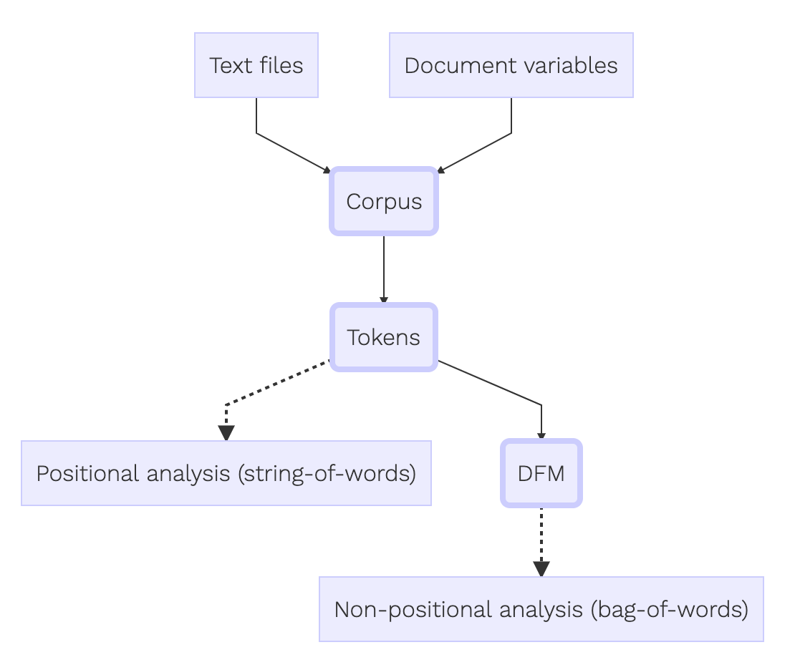

# Processamento dos dados {#processamento}

<!--- preview_chapter("06-wrangling.Rmd") --->

_Davi Moreira, Mônica Rocabado_

$~$ <!--- add line space --->

A análise de conteúdo só é possível através da transformação do texto bruto em estruturas de dados convenientes para o uso em pacotes. Esta etapa é fundamental e caso feita de forma errada pode levar a erros ou a impossibilidade da análise.
Temos basicamente quatro estruturas:

- *Tokens*: O texto pode ser armazenado em *n-grams* ou cadeias de caracteres (*strings*), por exemplo a frase "projeto de lei", em n-gram de tamanho 1, ou seja unigram, se torna "projeto" "de" "lei".
- *Corpus*: Esses tipos de objetos geralmente contêm strings brutas com metadados e detalhes adicionais. Também pode ser descrito como uma coleção de documentos.
- *Matriz de documentos e termos (DFM ou DTM)*: é uma matriz esparsa que descreve uma coleção (ou seja, um corpus) de documentos com uma linha para cada documento e uma coluna para cada termo. O valor na matriz é tipicamente contagem de palavras.

A análise do conteúdo do texto como dado exige versatilidade na transformação entre estruturas. Os pacotes vistos neste curso permitem essa versatilidade.


## Tokens

### O formato tidy text (texto arrumado)^[Toda essa seção está baseada no livro [Text Mining with R](https://www.tidytextmining.com/)]

Usar os princípios do _tidy_ _text_ é uma maneira poderosa de tornar o processamento de dados mais ágil e eficaz. Conforme [Wickham (2014)](https://www.tidytextmining.com/tidytext.html#ref-tidydata), os dados organizados têm uma estrutura específica:

- Cada variável é uma coluna
- Cada observação é uma linha
- Cada tipo de unidade de observação é uma tabela

<center>

</center>

Assim, o formato de texto arrumado nada mais é do que uma tabela com um *token* por linha. Um *token* é uma unidade de texto significativa, como uma palavra, e *tokenização* é o processo de dividir o texto em tokens. Para facilitar a mineração de texto, o token armazenado em cada linha geralmente é uma única palavra, mas também pode ser um *n-grama*, uma frase ou um parágrafo.


### Função `unnest_tokens`

Vejamos um trecho de "Canção do Exílio", poesia romântica de Gonçalves Dias escrita em 1843. No caso, estamos criando um vetor.

```{r, results = 'hide', echo = TRUE, eval = F, warning = F, message = F}
text <- c("Minha terra tem palmeiras", "Onde canta o Sabiá", 
          "As aves, que aqui, gorjeiam", "Não gorjeiam como lá")

```

```{r echo=FALSE}
knitr::kable(text)
```


Para transformar o vetor de strings num tidy text dataset, precisamos, primeiro, criar um data.frame`, através da função tibble, indicando a coluna linha com o número de linhas e a coluna text que irá conter o texto.

```{r, results = 'hide', echo = TRUE, eval = F, warning = F, message = F}
# carregando pacotes ----
library(dplyr)

text_df <- tibble(line = 1:4, text = text)

```

```{r echo=FALSE}
knitr::kable(text_df)
```


Um objeto `tibble` é uma classe moderna de `data.frames` dentro do `R`, disponível nos pacotes `dplyr` e `tibble`, que possui um método de impressão conveniente, não converte strings em fatores e não usa nomes de linhas. Tibbles são ótimos para uso com funções, pacotes e ferramentas tidy.

Contudo, nosso objeto `tibble` ainda não está coerente com a definição de tidy text que apresentamos. Para tanto, temos que converter nosso objeto em outro que atenda a condição *one-token-per-document-per-row*, logo cada token é um valor indicado por linha, no caso palavra. A função `unnest_tokens` presente no pacote realiza este processo de tokenização.

```{r, results = 'hide', echo = TRUE, eval = F, warning = F, message = F}
# carregando pacotes ----
library(tidytext)

text_token <- text_df %>%
  unnest_tokens(word, text)

```


```{r, echo=FALSE}
knitr::kable(text_token)
```


### Tidying a aprovação do impeachment da Presidenta Dilma Rousseff {#tidyDilma}

```{r, include=FALSE}

load("~/R/txt4cs/data/impeachment-dilma-dados-filter.rda")
```

Vamos utilizar como exemplo os discursos proferidos pelos parlamentares da Câmara dos Deputados na sessão de Impeachment da Presidenta Dilma Rousseff em Abril de 2016. Cada linha contém um discurso por parlamentar, podendo haver mais de um discurso por deputado. Para obter estes dados você precisa utilizar o pacote `txt4cs` 

```{r, results = 'hide', echo = TRUE, eval = TRUE, warning = F, message = F}
# carregando pacotes ----
library(dplyr)
library(stringr)
library(tidytext)
library(ggplot2)
devtools::install_github("davi-moreira/txt4cs-pkg")
library(txt4cs)

impeachment_dilma <- txt4cs::impeachment_dilma

```

Tokenizando os dados com os discursos dentro do formato Tidy, permitido ainda a associação do token com demais dados correspondentes, no caso o nome do deputado e o partido que participa.
A função `unnest_tokens`, como já colocado, permite a tokenização, no entanto deve-se indicar dois argumento principais para seu funcionamento: o nome da coluna que será criada, esta posta abaixo como `word` e indicar qual coluna se deseja realizar a tokenização, no caso `text`. O padrão da função é a divisão do texto por palavra, ou unigram, sendo possível sua alteração caso se queira um tamanho maior de n-grams.

```{r, results='hide', echo=TRUE, eval=FALSE, warning=FALSE, message=FALSE}

tidy_impeachment <- impeachment_dilma %>%
  unnest_tokens(word, text)


head(tidy_impeachment[,5], 30)

```


Como é possível notar, há uma diversidade de conectores e termos que não agregram valor a nossa análise, estes são chamados de `stopwords`, que serão removidos da base. Percebe-se também que no texto o nome do partido aparece sempre seguido do nome do deputado, dessa forma também será filtrado da análise.

```{r, results = 'hide', echo = TRUE, eval = F, warning = F, message = F}}

#stopwords
library(quanteda)
stop_w <- tibble(word = stopwords(source = "stopwords-iso", language = "pt"))

#remover o nome do partido
partido <- impeachment_dilma$partido %>%
  tibble() %>%
  distinct() %>%
  rename("word" = ".") %>%
  mutate(word = str_to_lower(word))

#retirar do corpus as stopwords
tidy_impeachment <- tidy_impeachment %>% 
  anti_join(stop_w) %>%
  anti_join(partido)
```

Com a informação já no formato tidy já é possível iniciar algumas análises com os dados, como a frequência de palavras:

```{r, results = 'hide', echo = TRUE, eval = F, warning = F, message = F}
tidy_impeachment %>%
  count(word, sort = TRUE) 
```

Também pode-se visualizar as frequências geradas
```{r, eval = F, message = F}
tidy_impeachment %>%
  count(word, sort = TRUE) %>%
  mutate(word = fct_reorder(word, n)) %>%
  filter(n > 400) %>%
  ggplot(aes(word, n)) +
  geom_col() +
  coord_flip() +
  labs(x="") 
```

Com o dado em formato Tidy, é possível comparar as palavras mais utilizadas por partido:

```{r, results = 'hide', echo = TRUE, eval = F, warning = F, message = F}
tidy_impeachment %>%
  count(word, partido, sort = TRUE) %>%
  mutate(word = fct_reorder(word, n)) %>%
  filter(n > 50) %>%
  ggplot(aes(fill = partido, x = word, y= n)) +
  geom_col() +
  coord_flip() +
  labs(x="") 
```

Avançando um pouco mais, já seria possível comparar o uso de palavras por diferentes deputados. Vamos comparar os deputados do PT, PSOL e do PSDB. Dessa forma, como o exemplo acima indica, já possuímos os dados em formato tidy, vamos selecionar os termos por partido.

                                  
```{r, results = 'hide', echo = FALSE, eval = TRUE, warning = F, message = F}

#Filtrar por partido
impeachment_pt <- impeachment_dilma %>% 
  filter(partido == "PT")

  
impeachment_psdb <- impeachment_dilma %>% 
  filter(partido == "PSDB")

impeachment_psol <- impeachment_dilma %>% 
  filter(partido == "PSOL")

#Transformando em um data frame
impeachment_pt <- tibble(line = 1:nrow(impeachment_pt),
                         text = impeachment_pt$text)  

impeachment_psdb <- tibble(line = 1:nrow(impeachment_psdb), 
                           text = impeachment_psdb$text)  

impeachment_psol <- tibble(line = 1:nrow(impeachment_psol), 
                           text = impeachment_psol$text)  


#Tokenizando

tidy_impeachment_pt <- impeachment_pt %>%
  unnest_tokens(word, text) %>%
  anti_join(stop_w) 

tidy_impeachment_psdb <- impeachment_psdb %>%
  unnest_tokens(word, text) %>%
  anti_join(stop_w) 
  
tidy_impeachment_psol <- impeachment_psol %>%
    unnest_tokens(word, text) %>%
    anti_join(stop_w) 

# frequencia de palavras

frequency <- bind_rows(mutate(tidy_impeachment_psol, author = "PSOL"),
                       mutate(tidy_impeachment_psdb, author = "PSDB"),
                       mutate(tidy_impeachment_pt, author = "PT")) %>%
  mutate(word = str_extract(word, "[a-z']+")) %>%
  count(author, word) %>%
  group_by(author) %>%
  mutate(proportion = n / sum(n)) %>% 
  select(-n) %>% 
  spread(author, proportion) %>% 
  gather(author, proportion, `PSOL`:`PSDB`)
  
# gráfico
ggplot(frequency, aes(x = proportion, y = `PT`,
                      color = abs(`PT` - proportion))) +
  geom_abline(color = "gray40", lty = 2) +
  geom_jitter(alpha = 0.1, size = 2.5, width = 0.3, height = 0.3) +
  geom_text(aes(label = word), check_overlap = TRUE, vjust = 1.5) +
  scale_x_log10(labels = scales::percent_format()) +
  scale_y_log10(labels = scales::percent_format()) +
  scale_color_gradient(limits = c(0, 0.001),
                       low = "darkslategray4", high = "gray75") +
  facet_wrap(~author, ncol = 2) +
  theme(legend.position="none") +
  labs(y = "PT", x = NULL)

```


Podemos quantificar quão diferente é o vocabulário através de um simples teste de correlação.

```{r, results = 'hide', echo = TRUE, eval = F, warning = F, message = F}

cor.test(data = frequency[frequency$author == "PSDB",],
         ~ proportion + `PT`)

```

## Corpus
O pacote `tidyverse` não possui uma função que gera um corpus, assim iremos utilizar o pacote `quanteda` que permite trabalhar com Tokens, Corpus e DFMs. Um ponto positivo em relação ao tidyverse é a possibilidade de gerar corpus e demais análises estas estando relacionadas ao documento que a originou. 

O uso do quanteda, segue o seguinte fluxograma:

<center>
{width=500px}
</center>

É possível criar um *corpus* a partir de diferentes fontes de dados:

1. Um vetor de caracteres que consista em um documento por elemento;

2. Uma matriz de dados que consista em um vetor de caracteres para os documentos e vetores adicionais para variáveis no nível do documento;

3. Um objeto de classe `VCorpus` ou `SimpleCorpus` criado pelo pacote `tm`;

4. Um objeto de palavras-chave no contexto construído por `kwic()`;

Utilizando a base de dados com as falas proferidas no dia da aprovação do impeachment da Presidenta Dilma Rousseff pela Câmara dos Deputados, nesta seção focaremos em como construir um corpus a partir de uma matriz de dados. A base de dados é a mesma utiliada no item anterior, podendo ser carregada através do pacote `text4cs`

```{r, results = 'hide', echo = TRUE, eval = F, warning = F, message = F}
# carregando pacotes ----
library(quanteda)
library(readtext)
library(stringr)
library(text4cs)

impeachment_dilma <- txt4cs::impeachment_dilma
````

Inicialmente devemos transformar o data.frame em um corpus, utilizando uma função do `quanteda`

````{r, results = 'hide', echo = TRUE, eval = F, warning = F, message = F}

corp <- corpus(impeachment_dilma)
summary(corp, 5)
```

### Filtrando corpus: `corpus_subset()`

A função `corpus_subset()` permite selecionar documentos em um corpus com base em variáveis no nível do documento. No caso iremos selecionar o corpus referente ao PSDB e PT.

```{r, results = 'hide', echo = TRUE, eval = F, warning = F, message = F}

corp_ptpsdb <- corpus_subset(corp, partido %in% c('PT', 'PSDB'))

summary(corp_ptpsdb, 5)

```

### Trocando a unidade de texto no corpus: `corpus_reshape()`

A função `corpus_reshape()` permite alterar a unidade de textos entre documentos, parágrafos e frases. Os textos podem ser restaurados para a unidade original mesmo que o corpus seja modificado por outras funções. 
Dessa forma, nos exemplos abaixo podemos mudar o corpus para formato de sentenças. A sentença segundo a função termina no ponto final e dá início a outra sentença.

```{r, results = 'hide', echo = TRUE, eval = F, warning = F, message = F}
corp_sent <- corpus_reshape(corp, to = 'sentences')

corp_sent[11:12]
````

Ou alterá-lo para um formato de documento, restaurando-os ao formato original:

```{r, results = 'hide', echo = TRUE, eval = F, warning = F, message = F}
# restaurando documentos originais ----
corp_documents <- corpus_reshape(corp_sent, to = 'documents')

corp_documents[2]

```

## Tokens e Corpus
### Obtendo Tokens a partir de um Corpus: `tokens()`

A função `tokens()`, é similar a função `unnest_tokens` do pacote `tidyverse`, ambas segmentam o texto, sua principal diferença é que ele não estrutura em forma de data frame com linhas e colunas o objeto tokenizado. Usaremos o corp gerado do item anterior. Esta função somente remove espaços em branco e demais separadores de texto automáticamente, para remoção de pontuação e números é necessário escrever no código. 

```{r, results = 'hide', echo = TRUE, eval = F, warning = F, message = F}

toks <- tokens(corp, remove_punct = TRUE) #tokenizando e removendo a pontuação

head(toks[[1]], 50)
````

### Palavras-chave e seu contexto: `kwic()`

Através dessa função presente no pacote `quanteda` é possível identificar o contexto imediato de um termo ou conjunto de palavras-chaves. No exemplo abaixo estamos buscando o contexto de palavras relacionadas a "golpe":
 
```{r, results = 'hide', echo = TRUE, eval = F, warning = F, message = F}
kw <- kwic(toks, pattern =  'golp*')
````

```{r, echo=FALSE}
knitr::kable(head(kw, 5))
```

Também é possível buscar mais de um termo por linha de código, assim como selecionar a quantidade de caracteres que apareçam com o termo procurado.

```{r, results = 'hide', echo = TRUE, eval = F, warning = F, message = F}
kw <- kwic(toks, pattern =  c("pela", "pelo"), window = 7)
````

```{r, echo=FALSE}
knitr::kable(head(kw, 5))
```

Caso queira identificar o contexto de frases, você deve dentro de `phrase` escrever uma frase respeitando os espaçoes em branco. 

````{r, results = 'hide', echo = TRUE, eval = F, warning = F, message = F}
# caso de uma frase inteira ----
kw_frase <- kwic(toks, pattern =  phrase('não vai ter golp*'))
```

```{r, echo=FALSE}
knitr::kable(kw_frase)
```


### Selecionando tokens
Como já colocado, `tokens` por padrão apenas remove separadores de texto e outros caracteres não textuais, estes se expressados no código. Para retirada de stopwords pode se fazer uso das funções `tokens_select` e `tokens_remove`, que são equivalentes. Novamente utilizaremos o corpus previamente construído.

```{r, results = 'hide', echo = TRUE, eval = F, warning = F, message = F}
#Construção de tokens sem pontuações
toks <- tokens(corp, remove_punct = T, remove_numbers = T)

# Temovendo as stopwords
#opção 1
toks_nostop <- tokens_select(toks, pattern = stopwords('pt'),
                             selection = 'remove')

#opção 2 
toks_nostop <- tokens_remove(toks_nostop, pattern = c('SR', 'PRESIDENTE', 
                                                      'Esclarecimentos'))
head(toks_nostop[[1]], 50)

```

Com a função `tokens_select` também é possível selecionar palavras-chaves para análise e construindo um novo objeto. Por exemplo, para analisar palavras que aparecem junto de termos determinados, e sua posição original no texto, se pode utilizar respectivamente `window` e `padding` ao escrever o código:

```{r, results = 'hide', echo = TRUE, eval = F, warning = F, message = F}

toks_voto <- tokens_select(toks, pattern = c("votaç*", "voto"), padding = TRUE, window = 5)
```

```{r, echo=FALSE}
head(toks_voto, 1)
```
## Stemming
Até aqui, mesmo que os procedimentos adotados tenham diminuído a dimensionalidade do acervo de documentos ao transformá-lo em uma sacola de palavras (*bag of words*), ainda é necessária a adoção de procedimentos que possam reduzir a complexidade do conteúdo a ser analisado.

Com esse objetivo, como apontado por Izumi e Moreira (2018) podemos pensar que determinado documento tenha em sua composição as seguintes palavras únicas: trabalho, trabalhador, trabalhista. Apesar de seus diferentes signficados, cada uma dessas palavras pode ser reduzida ao seu radical, _trabalh_, dando ao pequisador informações suficientes para sua análise e, assim reduzindo, o _n_ de três palavras únicas para uma palavra que tem a soma das frequências anteriores. Para garantir que palavras que variam apenas na flexão, número ou conjugação sejam consideradas iguais, reduzindo o número de dimensões contido no acervo, por meio da adaptação do algoritmo de Porter (1980) para o português já desenvolvida por diferentes projetos ([Snowball](http://snowball.tartarus.org/) e [NILC-USP](https://bit.ly/2OXkVS6)),podem ser obtidos os _stems_ das palavras restantes^[O processo de stemming é uma aproximação do processo de lematização, que reduz palavras às suas formas básicas.]. 

Chamamos esse procedimento de **Stemming**, o pacote `quanteda` possui a opção de stemming em português que usa o projeto Snowball através da função `tokens_wordstem()`, abaixo vamos utilizar o token já produzido no item acima.
                                  
```{r, results = 'hide', echo = TRUE, eval = F, warning = F, message = F}

token_stem <- tokens_wordstem(toks,language = "pt")

````

```{r, echo=FALSE}
head(token_stem, 1)
```

### Gerando n-grams

O método de tokenização apresentado nos itens acima se chama bag-of-words, ou BOW, e como observado nas análises realizadas, não respeita a ordem em que as palavras foram escritas. 

Para algumas análises essa ordem é necessária e para realizá-la pode-se utilizar o método N-grams, gerando assim tokens de qualquer tamanho e respeitando a ordem em que aparecem no texto. Através da função `tokens_ngrams()` é possível utilizar esse método. 

Com `tokens_ngram()` você pode definir o tamanho que deseja que seus tokens sejam criados, tanto especificando um n-gram único, ou estabelecendo um limite de tamanho de n-grams que o próprio R irá identificar no texto.


```{r, results = 'hide', echo = TRUE, eval = F, warning = F, message = F}

toks <- tokens(corp, remove_punct = T, remove_numbers = T)

#criando n-grams
toks_ngram <- tokens_ngrams(toks, n = 2:4)

head(toks_ngram[[1]], 20)
```

O `tokens_compound` realiza processo similiar, mas com a diferença de gerar n-grams de forma seletiva, especificando o termo de análise desejada. Após a seleção, para análise do resultado, você deve filtrar pelo termo com `tokens_select`

```{r, results = 'hide', echo = TRUE, eval = F, warning = F, message = F}
#Gerar n-grams específicas
toks_neg_bigram <- tokens_compound(toks, pattern = phrase('não *'))

#Selecionar as n-grams geradas
toks_neg_bigram_select <- tokens_select(toks_neg_bigram, pattern = phrase('não_*'))

#Resultado
head(toks_neg_bigram_select[[6]], 50)
```

## DFM: Matriz de documentos e termos
A função `dfm()` constrói uma matriz de documentos e termos/palavras/stems/tokens (DFM) a partir de um objeto de tokens. Relembrando que um DFM é uma vetorização do texto, em que cada linha representa um documento e cada coluna um termo.

```{r, results = 'hide', echo = TRUE, eval = F, warning = F, message = F}

#Construindo um corpus e removendo stopwords
toks <- tokens(corp, remove_punct = TRUE, remove_numbers = T)
toks <- tokens_select(toks, pattern = stopwords('pt'), selection = 'remove')

#Construindo um DFM
dfmat <- dfm(toks)
```

Você pode obter a quantidade de documento e features utilizando `ndoc` e `nfeat`

```{r, results = 'hide', echo = TRUE, eval = F, warning = F, message = F}
ndoc(dfmat)  # numero de documentos
```

```{r, results = 'hide', echo = TRUE, eval = F, warning = F, message = F}
nfeat(dfmat)  # numero de features
```

Também obter o nome dos documentos e das features com `docnames` e `featnames` e quais as features mais frequentes com `topfeatures`
```{r, results = 'hide', echo = TRUE, eval = F, warning = F, message = F}
head(docnames(dfmat), 20)  # ids dos documentos
```

```{r, results = 'hide', echo = TRUE, eval = F, warning = F, message = F}
head(featnames(dfmat), 20)  # algumas features
```

```{r, results = 'hide', echo = TRUE, eval = F, warning = F, message = F}
topfeatures(dfmat, 10)  # features mais frequentes
```


### Refinando a seleção de features

Você pode selecionar as features que tiveram uma frequência desejada para analisar através de `dfm_trim`. No caso, documentos com menos de 1% de frequência por features serão removidas, assim de 6320 features ficamos com 769 features.

```{r, results = 'hide', echo = TRUE, eval = F, warning = F, message = F}
dfmat_docfreq <- dfm_trim(dfmat, min_docfreq = 0.01, docfreq_type = "prop")

nfeat(dfmat_docfreq)
```


### Agrupando documentos numa DFM

Para agrupar os documentos em uma DFM, você pode utilizar a função `dfm_group`, que irá uni-los baseado em um argumento. No entanto, para simplificar o seu código, você pode agrupar baseado em um argumento no momento de gerar um dfm, como será mostrado nos exemplos abaixo.

```{r, results = 'hide', echo = TRUE, eval = F, warning = F, message = F}
# Por autor
dfmat_autor <- dfm(dfmat_docfreq, groups = "nomeOrador")

ndoc(dfmat_autor)
````

```{r, results = 'hide', echo = TRUE, eval = F, warning = F, message = F}
# Por partido ----
dfmat_party <- dfm(dfmat_docfreq, groups = "partido")

ndoc(dfmat_party)
```

## FCM: Matriz de co-ocorrência de termos
É possível construir uma FCM a partir de uma DFM ou um objeto de tokens usando a função `fcm()`, assim demonstrando o número de co-ocorrências de um feature, seu comportamento é similiar a uma DFM.

```{r, results = 'hide', echo = TRUE, eval = F, warning = F, message = F}
fcmat <- fcm(dfmat)
dim(fcmat)
````


Por meio de um FCT é possível retornar as palavras que ocorrem mais frequentemente com `topfeatures()`, assim como visualizar uma rede semântica com a função `textplot_network()`, por exemplo.

```{r, results = 'hide', echo = TRUE, eval = F, warning = F, message = F}

feat <- names(topfeatures(fcmat, 100))
fcmat_select <- fcm_select(fcmat, pattern = feat)
dim(fcmat_select)
````

Estabelecemos o tamanho da rede selecionando o DFM segundo as topfeatures criadas no objeto acima. Para plotar o gráfico das principais features utilizamos `textplot_network`, estabelecendo uma frequência mínima.

```{r, results = 'hide', echo = TRUE, eval = F, warning = F, message = F}
size <- log(colSums(dfm_select(dfmat, feat)))
set.seed(144)
textplot_network(fcmat_select, min_freq = 0.2, 
                 vertex_size = size / max(size) * 3)

```


