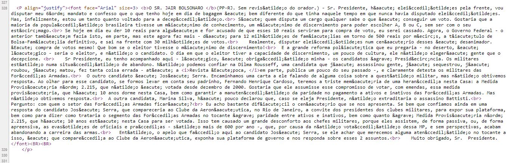

--- 
knit: 'bookdown::publish_book(render = "local")'
title: "_Text as Data_ para Ciências Sociais"
subtitle: 'guia prático com aplicações'
author: "Davi Moreira"
date: "`r Sys.Date()`"
site: bookdown::bookdown_site
documentclass: book
bibliography: [biblioteca.bib, book.bib, packages.bib]
biblio-style: apalike
link-citations: yes
description: "Compilação de métodos e técnicas para análise automatizada de conteúdo"
urlcolor: blue  
---

# Prefácio {-}

Placeholder


## Objetivo {-}
## Sobre o autor/organizador {-}
## Licença {-}
## Agradecimentos {-}

<!--chapter:end:index.Rmd-->


# Introdução {#intro}

Placeholder


## O `R` e o `RStudio`
## O Pacote `txt4cs` e outros
## Material de apoio
### Referências para processamento de sequências de caracteres com o `R`
### Referências em análise de conteúdo com o `R`:

<!--chapter:end:01-intro.Rmd-->


# Text as data: o texto como dado {#tada}

Placeholder


## Panorama da área
## Oportunidades
## Quadro geral de metodologias
## O processo de análise do texto como dado

<!--chapter:end:02-tada.Rmd-->


# R e o Processamento de Linguagem Natural {#regex}

Placeholder


## Encoding - Codificação de caracteres
## Encoding para remover acentos

<!--chapter:end:03-regex.Rmd-->


# Strings no `R` {#stringR}

Placeholder


## Strings e vetores
### O `R` é case sensitive
### Sequências de caracteres
### Operações básicas com vetores de strings
#### Atenção
### Caracteres e outros tipos de dados
## Strings e matrizes
## Strings e data.frames
## Strings e listas
## Processamento básico
### Contando caracteres
### `toupper()`, `tolower()`
#### Recortando strings:  `substr()`, `substring()`.  
#### União, Intersecção, Diferença, Igualdade
#### Elemento contido em
#### Ordenação
## O pacote `stringr` 
### Verificando o tamanho de uma string^[Assim como fizemos anteriormente com a função `nchar()`.]
### Identificando caracter numa posição específica.
### Incluindo caracter ou string numa posicao específica.
### Recortando uma string para obter parte da sequência de caracteres.
## Regular Expressions no `R`
### Identificação e Extração de padrão
### Substituição
### Âncoras

<!--chapter:end:04-string-R.Rmd-->

# Obtenção de conteúdo {#scrape}

Uma das tarefas mais importantes para a análise de conteúdo consiste na sua própria busca e aquisição. O `R` nos ajuda nessa tarefa a partir de distintas estratégias. A seguir apresento aquelas nas quais o uso de técnicas computacionais e programação potencializa o alcance e escala de acervos a serem utilizados para pesquisas.


## Dados tabelados em formato csv, excel, word ou pdf
Caso tenha realizado surveys com perguntas abertas ou possua conteúdo de texto organizado em formato de documento ou tabulado é possível utilizar o R para analisá-las. Para arquivos em formato excel deve-se usar o pacote `readxl` com a função `read_excel`, funciona de forma similar ao exemplo em de leitura de arquivos em csv. Para leitura de arquivos txt, csv, entre outros, recomenda-se utilizar o pacote `readr`.

```{r eval=FALSE}
#Leitura de arquivos em excel
library(readxl)
#arquivoexcel <- read_excel("seu_arquivo.xlsx")


#Para leitura dos arquivos em csv o formato é similar
# library(readr)
# arquivocsv <-read_csv("seu_arquivo.csv")

```

Antes de achar que os dados de um arquivo `.pdf` ou `.doc` são um obstáculo para a abordagem do texto como dado, diferentes estratégias podem ser adotadas para sua obtenção e processamento. Abaixo, vemos uma delas, com o uso do pacote `textreadr` de forma simples pode-se transformar o conteúdo do arquivo `.pdf` num arquivo `.txt`.


```{r, echo = TRUE, warning = F, message = F}
# Ler arquivos em formato PDF
# pacotes
library(textreadr)

# diretorio
here()

# .pdf para txt
#txt <- read_document("seu_arquivo.pdf")

# salvando .txt
#writeLines(txt, "seu_arquivo.txt")

```


## Webscraping

O *Webscraping* consiste na possibilidade de uso de programação para raspagem de dados da web, ou seja a obtenção de conteúdo presente na web. Nesse sentido, suponha que ao invés de montar uma equipe que irá acessar páginas na web para coletar seu conteúdo, você desenvolverá um programa específico para realizar essa tarefa com foco sobre os objetivos de sua pesquisa.

### Pacotes para raspagem de dados

Há diversos pacotes para raspagem de dados com o `R`. Abaixo segue um lista com os
principais. Para referências sobre seu uso, consulte os links indicados, 
[este tutorial sobre o `rvest`](https://www.datacamp.com/community/tutorials/r-web-scraping-rvest) e 
[este capitulo sobre web scraping](http://material.curso-r.com/scrape/). 

* [`httr`](https://cran.r-project.org/web/packages/httr/vignettes/quickstart.html)
* [`xml2`](https://cran.r-project.org/web/packages/xml2/xml2.pdf)
* [`rvest`](https://blog.rstudio.com/2014/11/24/rvest-easy-web-scraping-with-r/)

Como o site [Curso-R](http://material.curso-r.com/scrape/) destaca, esses pacotes não são suficientes para acessar todo tipo de conteúdo da web. Páginas com conteúdo produzido na linguagem `javascript`, por exemplo, precisam de outras ferramentas para acesso a seu conteúdo. Nesses casos, é necessário 
“simular” um navegador que acessa a página web e realiza consultas. Uma das melhores ferramentas para isso é o `selenium`, abaixo indicado.

* [`RSelenium`](https://ropensci.org/tutorials/rselenium_tutorial/)

Para iniciarmos , recomendo que instale os pacotes que iremos utilizar durante esse capítulo:
```{r, message=FALSE}
install.packages('tidyverse')
install.packages('rvest')
install.packages('httr')
install.packages('xml2')
install.packages('XML', type = "binary")
```


### Etapas para raspagem de dados na web
O processo de raspagem dos dados consiste nas seguintes etapas:

* Etapa 1. Conhecer detalhadamente o caminho para acesso aos dados
+ Qual o caminho que um usuário necessita realizar para obter os dados? Ele precisa preencher um formulário ou assinalar um Recapctha?
* Etapa 2. Armazenar todos os caminhos de acesso aos dados de forma amigável ao programa
+ Caso exista um caminho para obter esse dado, deve ser registrado
++ Não é necessário realizar esse procedimento em todos as páginas que for realizar, mas é desejável.
* Etapa 3. Obter os dados: raspagem de fato
* Etapa 4. Processar os dados obtidos

### Código fonte 
Toda página na internet possui um código-fonte, muitas vezes em html ou demais formatos que indica e cria o conteúdo de forma visual para página. Ao clicar na página desejada com o botão direito do mouse e selecionar “código fonte” ou digitar `CRTL` + `U`, pode-se ver visualizá-lo.


* [Discursos Deputados](https://www2.camara.leg.br/atividade-legislativa/discursos-e-notas-taquigraficas)

<center>
{width=400px}

</center>


#### Obtenção de Código Fonte - Exemplo prático:

Vamos obter o conteúdo presente [nesta página do portal da Câmara dos Deputados](https://www.camara.leg.br/internet/SitaqWeb/TextoHTML.asp?etapa=5&nuSessao=174.4.53.O&nuQuarto=56&nuOrador=2&nuInsercao=0&dtHorarioQuarto=11:46&sgFaseSessao=BC&Data=17/08/2010&txApelido=JAIR%20BOLSONARO,%20PP-RJ&txFaseSessao=Breves%20Comunica%C3%A7%C3%B5es&txTipoSessao=Extraordin%C3%A1ria%20-%20CD&dtHoraQuarto=11:46&txEtapa=) que apresenta um dos discursos realizados pelo então Deputado Jair Bolsonaro^[Conteúdo publicado sem revisão do autor.].

Como guia para nossa tarefa, vamos utilizar as Etapas anteriormente apresentadas:

De uma só vez, conseguimos cumprir as Etapas 1 e 2 com o código abaixo:

**Etapa 1. Conhecer detalhadamente o caminho para acesso aos dados:** o código fonte do endereço virtual que apresenta o discurso também nos apresenta o conteúdo publicado.

**Etapa 2. Armazenar todos os caminhos de acesso aos dados de forma amigável ao programa:** nesse exemplo, trata-se de apenas um endereço que armazenamos no objeto `link`.

```{r, echo = TRUE, warning = F, message = F}
# carregando pacotes ----
library(tidyverse)
library(rvest)
library(httr)
library(xml2)

# definindo o endereço da web
link <- "https://www.camara.leg.br/internet/SitaqWeb/TextoHTML.asp?etapa=5&nuSessao=174.4.53.O&nuQuarto=56&nuOrador=2&nuInsercao=0&dtHorarioQuarto=11:46&sgFaseSessao=BC&Data=17/08/2010&txApelido=JAIR%20BOLSONARO,%20PP-RJ&txFaseSessao=Breves%20Comunica%C3%A7%C3%B5es&txTipoSessao=Extraordin%C3%A1ria%20-%20CD&dtHoraQuarto=11:46&txEtapa="
```

**Etapa 3. Obter os dados:** Podemos facilmente obter o código fonte de um endereço na internet com o uso da função `readLines`. Aplicamos, portanto, a função sobre o objeto `link` e o salvamos no objeto `conteudo`.

```{r, echo = TRUE, warning = F, message = F}
conteudo <- readLines(link)  # obtem o codigo fonte
```

Veja que o objeto `conteudo` é um vetor cujos elementos são cada uma das linhas presentes no código fonte da página. Isso significa que não precisamos mais do acesso à internet ou do próprio endereço para processar o conteúdo obtido uma vez que já está retido na memória física do computador. Nessa etapa, pode ser conveniente salvar o objeto `conteudo` do modo como foi obtido para posterior tratamento.

Para finalizar nossa tarefa de obter o conteúdo do discurso do então Deputado Jair Bolsonaro, proferido em 17 de agosto de 2010, vamos para a última etapa.

Uma rápida análise do objeto `conteudo` (código fonte da página que publicou o discurso), nos mostra que o elemento 328 apresenta o conteúdo de interesse. A análise também pode ser feita no próprio código fonte da página ao utilizar o `CRTL` + `U`, como segue na imagem abaixo:

<center>
{width=400px}

</center>


**Etapa 4. Processar os dados obtidos:** Logo, vamos selecionar apenas o elemento 328 e assim concluímos nossa missão.

```{r, echo = TRUE, warning = F, message = F}
conteudo <- conteudo[328]
```

##### Atividade prática

Com base no exemplo acima, obtenha o código fonte da página do [Chico Buarque na Wikipédia](https://pt.wikipedia.org/wiki/Chico_Buarque). 

## Web Service

Os [Web services](https://pt.wikipedia.org/wiki/Web_service) são componentes que 
permitem às aplicações enviar e receber dados. Os Web Services são utilizados para disponibilizar serviços interativos na Web, podendo ser acessados por outras aplicações. O objetivo dos Web Services é a comunicação de aplicações através da Internet. Um dos motivos que tornam os Web Services atrativos é o fato deste modelo ser baseado em tecnologias standards, em particular XML e HTTP (Hypertext Transfer Protocol). 

#### Obtenção de conteúdo via WS - Exemplo prático:

A Câmara dos Deputados do Brasil possui um excelente serviço de transparência. Estimulado pela iniciativa do [Laboratório Hacker](http://labhackercd.leg.br/), foi desenvolvido o [Web service da Câmara dos Deputados](http://www2.camara.leg.br/transparencia/dados-abertos/dados-abertos-legislativo/webservices).


<center>
{width=400px}

</center>


Após a realização da Primeira Maratona Hacker da Câmara dos Deputados, quando fora desenvolvido o [Projeto Retórica Parlamentar](http://retorica.labhackercd.leg.br/), o Web Service da CD passou a disponibilizar os discursos proferidos pelos deputados federais em plenário. 

Nossa tarefa será a de obter os dados e o conteúdo dos discursos proferidos no dia 11 de setembro de 2001, quando ocorreu o [atentado às Torres Gêmeas em Nova Iorque nos Estados Unidos](https://pt.wikipedia.org/wiki/Ataques_de_11_de_setembro_de_2001). Em virtude da estrutura de disponibilização dos dados no WS, nossa tarefa será dividida em duas subtarefas: a) obter os meta-dados dos discursos; b) obter o conteúdo dos discursos (inteiror teor).

#### a) obter os meta-dados dos discursos

Como guia para nossa subtarefa, vamos utilizar as Etapas anteriormente apresentadas:

De uma só vez, conseguimos realizar as Etapas 1 e 2:

**Etapa 1. Conhecer detalhadamente o caminho para acesso aos dados:** conhecendo exatamente como deve ser a chamada (o endereço que dá acesso aos dados), podemos simplesmente passar os parâmetros. Os parâmetros podem ser encontrados no guia do [WS](https://www2.camara.leg.br/transparencia/dados-abertos/dados-abertos-legislativo/webservices/sessoesreunioes-2/listardiscursosplenario). No nosso exemplo, temos como parâmetros a data inicial (`dataInicial`) e a data final (`dataFinal`) de busca pelos discursos. Sendo nosso objetivo obter os discursos proferidos num mesmo dia, usamos como parâmetros "11/09/2001".

**Etapa 2. Armazenar todos os caminhos de acesso aos dados de forma amigável ao programa:** nesse exemplo, trata-se de apenas um endereço que armazenamos no objeto `link`.


```{r, results = 'asis', eval = FALSE}
# carregando pacotes -----------------------------------------------------------
library(httr)
library(XML)
library(xml2)
library(RCurl)
library(tidyverse)
library(stringr)

dataInicial <- "11/09/2001" 
dataFinal <- "11/09/2001"

link <- paste("https://www.camara.leg.br/sitcamaraws/SessoesReunioes.asmx/ListarDiscursosPlenario?",
                "dataIni=", dataInicial,
                "&dataFim=", dataFinal, 
                "&codigoSessao=&parteNomeParlamentar=&siglaPartido=&siglaUF=",
                sep = "")
```

**Etapa 3. Obter os dados:** para essa etapa, basta fazer uso da função `GET`. No código abaixo, armazenamos os resultados no objeto `response`.

```{r, results = 'asis', eval = FALSE}
response <- GET(link)
```

**Etapa 4. Processar os dados obtidos:** organizar o resultado da função `GET` num formato de matriz de dados (`data.frame`) é simples. Primeiro, transformamos o resultado numa lista, na qual cada elemento será uma das sessões legislativas realizadas naquela data. Em segundo lugar, de forma interativa, usando a função `for`, alocamos os campos desejados num objeto `data.frame`^[Para uma referência de como transformar objetos `xml` em `data.frame` ver: i) (https://stackoverflow.com/questions/17198658/how-to-parse-xml-to-r-data-frame); ii) (https://stackoverflow.com/questions/13579996/how-to-create-an-r-data-frame-from-a-xml-file)].

```{r, results = 'asis', eval = FALSE}
################################################################################
data <- xmlParse(response, encoding = "UTF-8") #analisa um arquivo XML ou HTML e gera uma estrutura no R.
ls <- xmlToList(data) #transforma um XML nó em lista. Importante pois permite você reconhecer o caminho para obtenção dos dados. Exemplo: "$sessao$fasesSessao$faseSessao$discursos$discurso$sumario"

bd <- data.frame()  # data frame que recebera dados dos pronunciamentos

for (i in 1:length(ls)){
    # obtendo quantidade de pronunciamentos de uma respectiva sessao
    quantPronunciamentos <- length(ls[i]$sessao$fasesSessao$faseSessao$discursos)
    
    sumario <- vector("character")
    numInsercao <- vector("character")
    numQuarto <- vector("character")
    indexacao <- vector("character")
    hora <- vector("character")
    uf <- vector("character")
    numOrador <- vector("character")
    nomeOrador <- vector("character")
    partido <- vector("character")
    
    for(j in 1:quantPronunciamentos){
      # obtendo todos os dados do pronunciamento
      # sumario
      sumario[j] <- 
        str_trim(ls[i]$sessao$fasesSessao$faseSessao$discursos[[j]]$sumario)
      # insercao
      numInsercao[j] <- 
        str_trim(ls[i]$sessao$fasesSessao$faseSessao$discursos[[j]]$numeroInsercao)
      # quarto
      numQuarto[j] <- 
        str_trim(ls[i]$sessao$fasesSessao$faseSessao$discursos[[j]]$numeroQuarto)
      # indexacao
      indexacao[j] <- 
        str_trim(ls[i]$sessao$fasesSessao$faseSessao$discursos[[j]]$txtIndexacao)
      # hora
      hora[j] <- 
        str_trim(ls[i]$sessao$fasesSessao$faseSessao$discursos[[j]]$horaInicioDiscurso)
      # uf orador
      uf[j] <- 
        str_trim(ls[i]$sessao$fasesSessao$faseSessao$discursos[[j]]$orador$uf)
      # numero orador
      numOrador[j] <- 
        str_trim(ls[i]$sessao$fasesSessao$faseSessao$discursos[[j]]$orador$numero)
      # nome orador
      nomeOrador[j] <- 
        str_trim(ls[i]$sessao$fasesSessao$faseSessao$discursos[[j]]$orador$nome)
      # partido orador
      partido[j] <- 
        str_trim(ls[i]$sessao$fasesSessao$faseSessao$discursos[[j]]$orador$partido)
    }
    
    # obtendo todos os dados da fase
    # codigo
    codigoFase <- str_trim(ls[i]$sessao$fasesSessao$faseSessao$codigo)
    # descricao
    descricaoFase <- str_trim(ls[i]$sessao$fasesSessao$faseSessao$descricao)
    # obtendo todos os dados da sessao
    # codigo
    codigoSessao <- str_trim(ls[i]$sessao$codigo)
    # data
    dataSessao <- str_trim(ls[i]$sessao$data)
    # numero
    numSessao <- str_trim(ls[i]$sessao$numero)
    # tipo
    tipoSessao <- str_trim(ls[i]$sessao$tipo)
    
    bdTemp <- data.frame(codigoSessao = rep(codigoSessao, length(nomeOrador)),
                         dataSessao = rep(dataSessao, length(nomeOrador)),
                         numSessao = rep(numSessao, length(nomeOrador)),
                         tipoSessao = rep(tipoSessao, length(nomeOrador)),
                         codigoFase = rep(codigoFase, length(nomeOrador)),
                         descricaoFase = rep(descricaoFase, length(nomeOrador)),
                         numInsercao = numInsercao,
                         numQuarto = numQuarto,
                         hora = hora,
                         numOrador = numOrador,
                         nomeOrador = nomeOrador,
                         uf = uf,
                         partido = partido, 
                         indexacao = indexacao,
                         sumario = sumario)
    
    bd <- rbind(bd, bdTemp)
    
  }

head(bd)

```

Com o objeto `bd` acima, concluímos a primeira subetapa e podemos seguir para a segunda.

#### b) obter o conteúdo dos discursos (inteiror teor).**

Importante ressaltar que essa etapa só é possível tendo realizado o método acima de `ListarDiscursosPlenário`, devido exigência do próprio webservice.

```{r results = 'asis', eval = FALSE}

bdDados <- bd

bd <- data.frame()  # data frame que recebera os pronunciamentos
  
for( i in 1:dim(bdDados)[1]){
    link <- paste("https://www.camara.leg.br/SitCamaraWS/SessoesReunioes.asmx/obterInteiroTeorDiscursosPlenario?",
                  "codSessao=", bdDados$codigoSessao[i],
                  "&numOrador=", bdDados$numOrador[i], 
                  "&numQuarto=", bdDados$numQuarto[i],
                  "&numInsercao=", bdDados$numInsercao[i],
                  sep = "")
    print(link)
    response <- GET(link)
    data <- xmlParse(response, encoding = "UTF-8")
    ls <- xmlToList(data)
    
    bdTemp <- data.frame(nome = ls$nome,
                         partido = ls$partido,
                         uf = ls$uf,
                         horaInicioDiscurso = ls$horaInicioDiscurso,
                         discursoRTFBase64 = ls$discursoRTFBase64)
    bd <- rbind(bd, bdTemp)
    Sys.sleep(.5)
  }

head(bd)
```

Obtivemos os discursos em seu inteiro teor, no entanto estão em formato RTF codificado em BAse64, dessa forma precisamos transformá-los para possibilitar sua leitura.
```{r}

bd$discursoRTFBase64 <- as.character(bd$discursoRTFBase64)

bd$discursoPlainTxt <- vector(mode = "character", 
                                           length = dim(bd)[1])

for (i in 1:dim(bd)[1]){
  bd$discursoPlainTxt[i] <- decode_rtf(bd$discursoRTFBase64[i])
  print( bd$discursoPlainTxt)
}


```


##### Atividade prática

Utilizando o codigo acima, obtenha as falas proferidas do dia da autorização do processo de  impeachement da Presidenta Dilma Vana Rousseff na Câmara dos Deputados, ocorrido em 17 de abril de 2016. Salve os dados em formato `.RData`.


## Download de arquivos `.pdf` na web

Além do conteúdo diretamente publicado numa página web, pode ser de interesse fazer o download de arquivos disponíveis. Em especial, no caso brasileiro, muitos órgãos públicos publicam relatórios em formato `.pdf`. O obstáculo proporcionado pelo formato do arquivo e o modo como o conteúdo é disponibilizado pode ser superado com o uso da linguagem `R`.

#### Download de arquivos - Exemplo prático:

Como exemplo, vamos conferir o caso do [Tribunal de Contas do Estado de Pernambuco](https://www.tce.pe.gov.br/internet/), que anualmente disponibiliza relatórios de gestão.

<center>
{width=400px}

</center>


Mais uma vez, vamos utilizar as Etapas anteriormente apresentadas:

**Etapa 1. Conhecer detalhadamente o caminho para acesso aos dados:** A [página do TCE-PE]("https://www.tce.pe.gov.br/internet/index.php/relatorios-de-gestao-fiscal-2") apresenta os relatórios publicados anualmente.

```{r, echo = TRUE, warning = F, message = F}
library(rvest)
library(XML)
library(xml2)

# ETAPA 1. Conhecer detalhadamente o caminho para acesso aos dados
link_tcu <- "https://www.tce.pe.gov.br/internet/index.php/relatorios-de-gestao-fiscal-2"
```

**Etapa 2. Armazenar todos os caminhos de acesso aos dados de forma amigável ao programa:** aqui selecionamos exatamente os endereços de download de cada um dos arquivos publicados. Todos os pdf são um link dentro do código fonte da página, iremos obter os links desses relatórios. Como podemos ver na imagem abaixo, os pdfs estão escritos da seguinte forma no código html:

<center>
{width=400px}

</center>

Podemos observar o formato do código escrito, assim que possui um padrão que identifica os relatórios de Desempenho anual: `rdg`. Iremos utilizá-lo para obter somente os documentos que possuam esse padrão.

```{r, echo = TRUE, warning = F, message = F}
# ETAPA 2. Armazenar todos os caminhos de acesso aos dados de forma amigável ao programa
link_relatorios <- link_tcu %>% 
  read_html %>%  #função que irá ler o código fonte escrito em html
  html_nodes("a") %>%  # nó presente no código fonte antes do pdf
  html_attr("href") #atributro do nó

link_relatorios <- link_relatorios[grep("rdg", link_relatorios)] #obtenção dos links do relatório através do padrão `rgd`
```

Etapa 3. Obter os dados: a obtenção dos dados se refere justamente ao download do material para armazenamento local. Para tanto, definimos o diretório onde os arquivos serão salvos e fazemos uso da função `download.file`. No caso obtivemos 6 links, então iremos obter o primeiro arquivo pdf em `link_relatorios[1]`

```{r, echo = TRUE, warning = F, message = F}
#################################################################################
# ETAPA 3. Obter os dados
library(here)
here()

download.file(link_relatorios[1], destfile = "nome_arquivo.pdf", mode = "wb")

```

Etapa 4. Processar os dados obtidos: O processo é similar a da leitura de pdf explicada no item de leitura de arquivos `.pdf`

```{r, echo = TRUE, warning = F, message = F}
#################################################################################
# ETAPA 4. Processar os dados obtidos 
# pacotes
library(textreadr)
library(here)

# diretorio
here()

# .pdf para txt

rdg2018 <- read_document("nome_arquivo.pdf")

# salvando .txt
writeLines(rdg2018, "meu_arquivo.txt")

```


## Twitter

Existem diversos pacotes que possibilitam a captura de informação do twitter, sendo possível obter tweets ou timelines somente de usuários públicos, ou seja que não possuem um perfil privado. Para tal, vamos utilizar o pacote [`rtweet`](https://github.com/ropensci/rtweet) para obter dados dos tweets da timeline da Deputada Federal Tabata Amaral. Vale ressaltar que o twitter exige que para obtenção dos dados você possua uma conta no twitter e autorize o app `rstats2twitter` no popup que surgirá no seu browser ao utilizar alguma das funções no console do R, isso ocorrerá somente na primeira vez de uso, criando um token que será salvo para próximas sessões.  

```{r}
library(rtweet)
tabata_timeline <- get_timeline( user = "tabataamaralsp", n = 100)
head(tabata_timeline)

```

Além do uso de obtenção de hashtags é possível buscar termos que estão sendo tweetados ou hashtags através do `search_tweets` que segue lógica similar ao `get_timeline`


## Imagens

No caso de textos em imagem é possível utilizar o _optical character recognition_ (OCR). OCR é o processo de encontrar e reconhecer texto dentro de imagens, por exemplo, de uma captura de tela, texto digitalizado. A imagem abaixo tem um texto de exemplo:

<center>
{width=400px}

</center>

Com o pacote [`Tesseract`](https://cran.r-project.org/web/packages/tesseract/vignettes/intro.html) e o uso da [Interface de Programação de Aplicativos (API) do Google](https://cloud.google.com/vision/) é possível capturar seu conteúdo, podendo ser uma imagem presente no seu computador ou da web. Para realizá-lo em português é necessário instalar o acervo de treinamento em português com o seguinte comando `tesseract_download('por')`. No caso vamos utilizar a imagem do Tweet Fake atribuído ao Presidente Bolsonaro para obter seu conteúdo:


```{r, results = 'hide', echo = TRUE, results = 'hide', warning = F, message = F}

if(require(tesseract) == F) install.packages('tesseract'); require(tesseract);
tesseract_download('por')
por <- tesseract("por")
text <- tesseract::ocr("https://raw.githubusercontent.com/davi-moreira/txt4cs/master/images/tweet_bolsonaro_cp.png", engine = por)
cat(text)
```


## Áudio Transcrição

EM CONSTRUÇÃO...........

<!--chapter:end:05-obtencao-conteudo.Rmd-->

# Processamento dos dados {#processamento}

EM CONSTRUÇÃO...

## Tokens

## Corpus

## Tokens e Corpus

## DFM: Matriz de documentos e termos

## Stemming

## FCM: Matriz de co-ocorrência de termos

<!--chapter:end:06-wrangling.Rmd-->

# Mineração e estatísticas básicas {#stat}

EM CONSTRUÇÃO...

## Análise de frequência

## Nuvem de palavras

## tf-idf

## Rede de n-grams

## Correlação pareada

## Diversidade lexical

## Similaridade entre documentos/termos

## KEYNESS: Análise de Frequência Relativa

<!--chapter:end:07-statistics.Rmd-->

# Escalonamento {#scalling}

EM CONSTRUÇÃO...

## Wordscore

## Wordfish


<!--chapter:end:08-escalonamento.Rmd-->

# Classificação {#classificacao}

EM CONSTRUÇÃO...

## Método de dicionário: Análise de sentimento

## Naive Bayes

## LDA: Latent Dirichlet Allocation 

## STM: Structed Topic Model

<!--chapter:end:09-classificacao.Rmd-->

`r if (knitr::is_html_output()) '
# Referências {-}
'`

<!--chapter:end:99-references.Rmd-->

---
title: "teste"
author: "monimazz"
date: "13/08/2020"
output: html_document
---

```{r setup, include=FALSE}
knitr::opts_chunk$set(echo = TRUE)
```

## Git

- https://medium.com/@jonathanmines/the-ultimate-github-collaboration-guide-df816e98fb67
- https://dev.acquia.com/blog/getting-started-collaborative-development-git
- https://happygitwithr.com/

<!--chapter:end:complementary-material.Rmd-->


## R Markdown
## Including Plots

<!--chapter:end:dddd.Rmd-->

